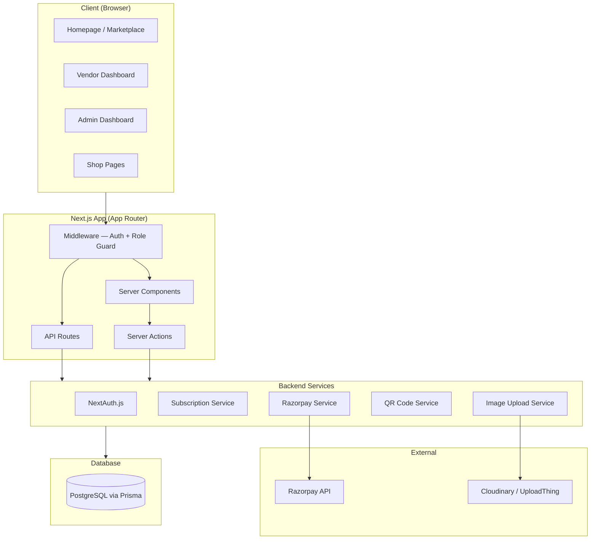

# Vendor Marketplace SaaS Platform — Overview & Architecture

## Context
A multi-vendor marketplace where shopkeepers create catalogue pages with subscription-based activation, QR codes for physical distribution, and role-based dashboards.
The frontend UI has mostly been generated/styled via Stitch, but the Next.js scaffold and full backend architecture need to be built by you (Claude).

## High-Level Architecture

## Tech Stack
- **Framework**: Next.js 14 (App Router)
- **Language**: TypeScript
- **Styling**: Tailwind CSS + Framer Motion
- **Auth**: NextAuth.js v5 (credentials provider)
- **ORM**: Prisma
- **Database**: PostgreSQL
- **Payments**: Razorpay
- **Image Upload**: UploadThing
- **QR Codes**: `qrcode` npm package
